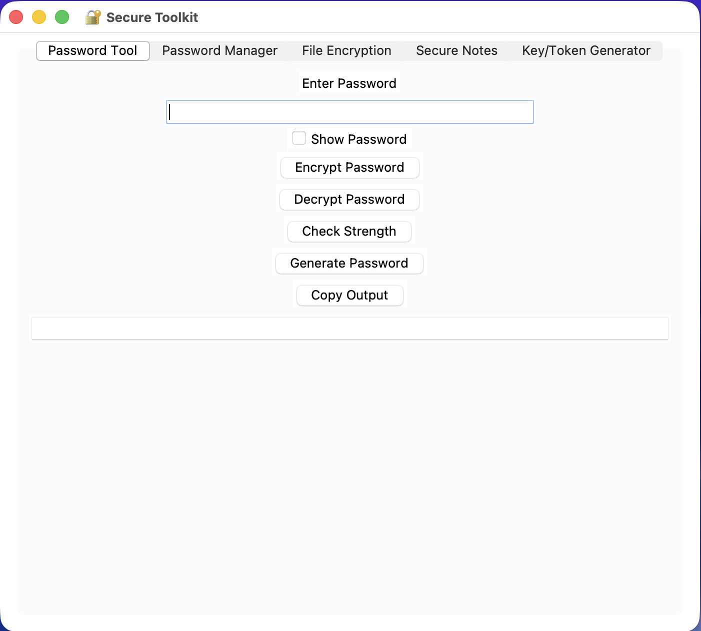
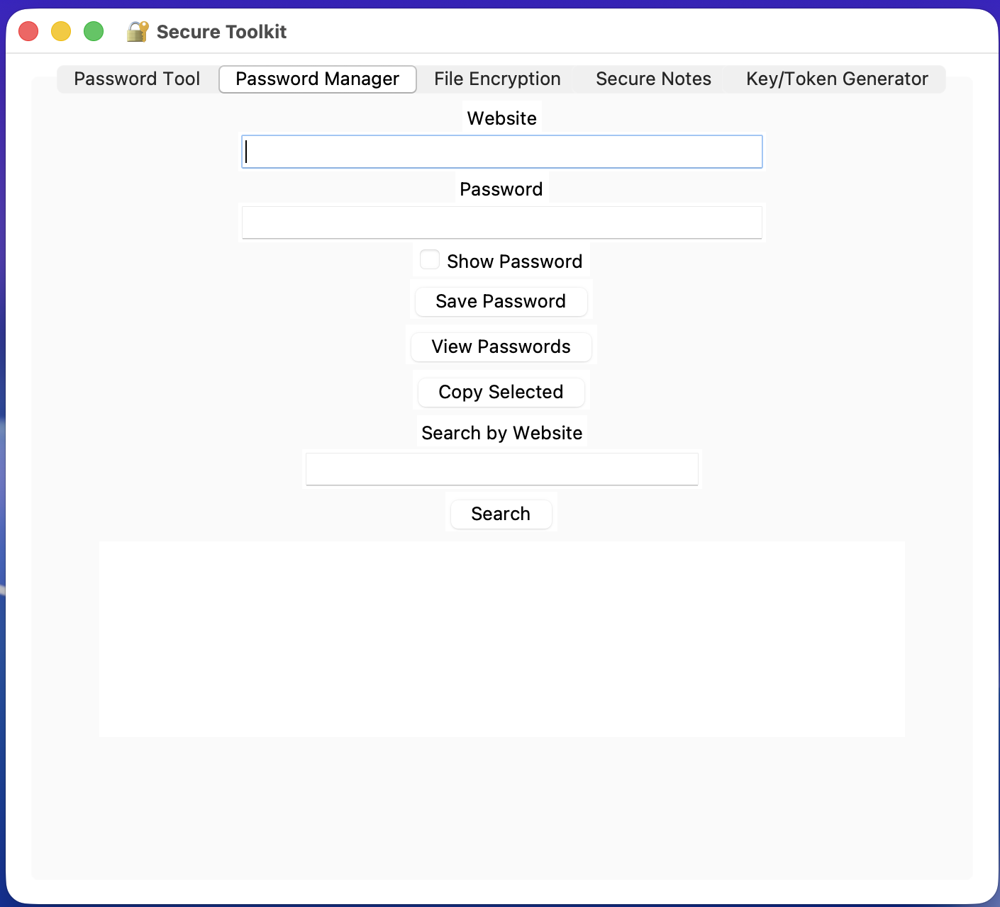
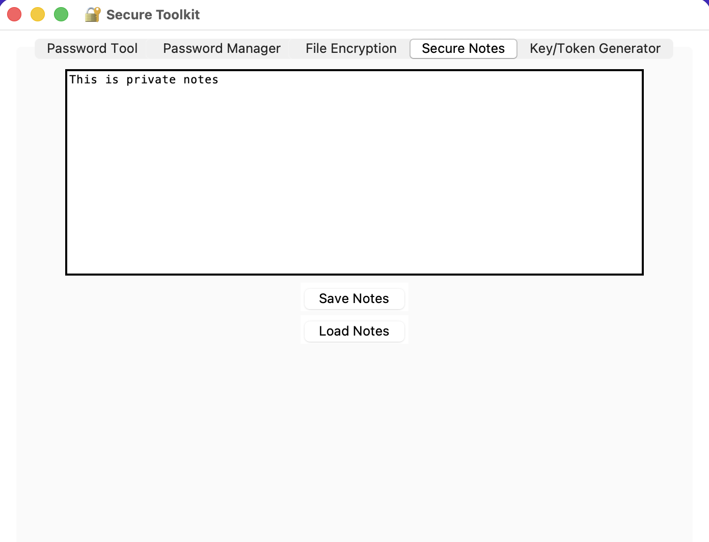
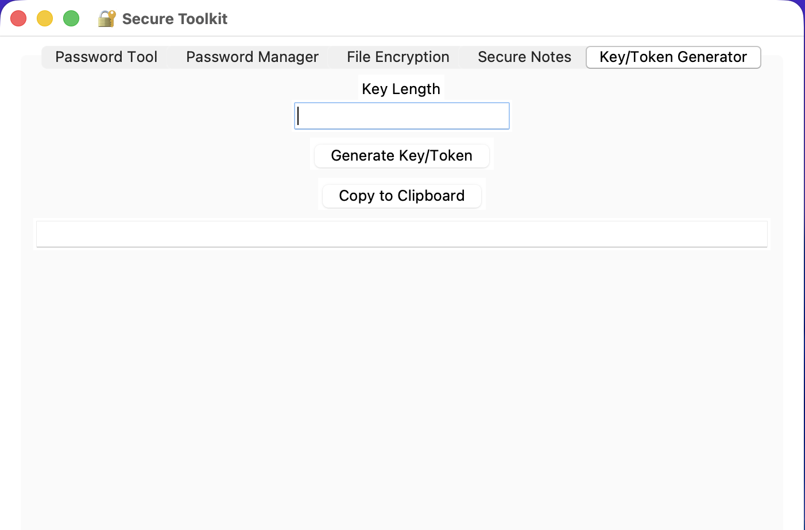

# 🔐 Secure Toolkit — Python Security Application

A `Python` desktop application built with `Tkinter` that provides tools for 
**password management**, **file encryption**, **secure notes**, and **key/token generation**.

The application focuses on practical implementations such as 
**local data storage**, `encryption workflows`, and **user-friendly desktop interfaces**. 
Each module is designed to be **modular**, **readable**, and **easy to extend**.

This project is intended as a **portfolio-grade** example showcasing 
`Python application development`, **clean code organization**, and 
**desktop GUI design** using `Tkinter`.

---

## 📌 Overview

**Secure Toolkit** is a multi-module Python application that allows users to:

- Encrypt and decrypt sensitive data
- Securely store credentials and notes
- Protect files using strong symmetric encryption
- Generate cryptographically secure keys and passwords

The project emphasizes **clarity, security awareness, and real-world usability**.

---

## 🎥 Demo / Screenshots


<details> <!-- 1st -->

<summary>Password Tool Image</summary>

Main dashboard of the password management tool:



</details>


<details> <!-- 2nd -->

<summary>Password Manager Image</summary>

The main dashboard for securely storing, viewing, and managing encrypted passwords:



</details>


<details> <!-- 3rd -->

<summary>File Encryption Image</summary>

Interface for encrypting and decrypting files using strong cryptographic keys:


</details>


<details> <!-- 4th -->

<summary>Secure Notes Image</summary>

Secure notes section for storing sensitive information with encryption protection:



</details>


<details> <!-- 5th -->

<summary>Key/Token Generator Image</summary>

Built-in generator for creating strong passwords, cryptographic keys, and secure tokens:



</details>

---

## ✨ Key Features

### 🔑 Password Encryption Tool
- Reversible password encryption using **Fernet (AES)**
- Password decryption with key-based security
- Password strength analysis
- Secure random password generation
- Clipboard copy support
- Show / hide password toggle

---

### 🗂️ Encrypted Password Manager
- Secure storage of website credentials
- All data encrypted before being written to disk
- Search functionality for stored credentials
- Decryption performed only inside the application
- Clipboard support for selected entries

---

### 📁 File Encryption & Decryption
- Encrypt and decrypt files using AES encryption
- Supports multiple file selection
- Automatic backup creation during decryption
- Prevents accidental data loss

---

### 📝 Secure Notes
- Encrypted personal notes storage
- Notes remain encrypted on disk at all times
- Decryption occurs only on demand

---

### 🔐 Key / Token Generator
- Generates cryptographically secure random keys
- Customizable key length
- Suitable for tokens, API keys, or secrets

---

## 🗂️ Project Structure

```text
secure-toolkit/
│
├── secure_toolkit.py        # Main application (GUI + logic)
├── secret.key               # Symmetric encryption key (auto-generated)
├── passwords.enc            # Encrypted credentials storage
├── notes.enc                # Encrypted secure notes
├── README.md                # Project documentation
└── venv/                    # Virtual environment (optional)
```

## 🛠️ Installation

### 1️⃣ Clone the Repository
```bash
  git clone https://github.com/DevGopi-17/Multi-Functional-Security-Toolkit.git
  cd Multi-Functional-Security-Toolkit
```

## Create & Activate Virtual Environment (Recommended)
```bash
python3 -m venv venv
# macOS / Linux
source venv/bin/activate

# Windows (PowerShell)
venv\Scripts\Activate.ps1

# Windows (CMD)
venv\Scripts\activate.bat
```

## Run the Application

```bash
python secure_toolkit.py
```
---

## 🤝 Contributing
Feel free to submit issues or pull requests. Future enhancements may include:
- Multi-user support
- Cloud synchronization
- Additional encryption algorithms
- Improved UI/UX
- Automated testing & CI/CD
- Plugin system

---

## MIT License

Copyright (c) 2026 Gopi Prajapati

Permission is hereby granted, free of charge, to any person obtaining a copy
of this software and associated documentation files (the "Software"), to deal
in the Software without restriction, including without limitation the rights
to use, copy, modify, merge, publish, distribute, sublicense, and/or sell
copies of the Software, and to permit persons to whom the Software is
furnished to do so, subject to the following conditions:

The above copyright notice and this permission notice shall be included in all
copies or substantial portions of the Software.

THE SOFTWARE IS PROVIDED "AS IS", WITHOUT WARRANTY OF ANY KIND, EXPRESS OR
IMPLIED, INCLUDING BUT NOT LIMITED TO THE WARRANTIES OF MERCHANTABILITY,
FITNESS FOR A PARTICULAR PURPOSE AND NONINFRINGEMENT. IN NO EVENT SHALL THE
AUTHORS OR COPYRIGHT HOLDERS BE LIABLE FOR ANY CLAIM, DAMAGES, OR OTHER
LIABILITY, WHETHER IN AN ACTION OF CONTRACT, TORT OR OTHERWISE, ARISING FROM,
OUT OF OR IN CONNECTION WITH THE SOFTWARE OR THE USE OR OTHER DEALINGS IN THE
SOFTWARE.


